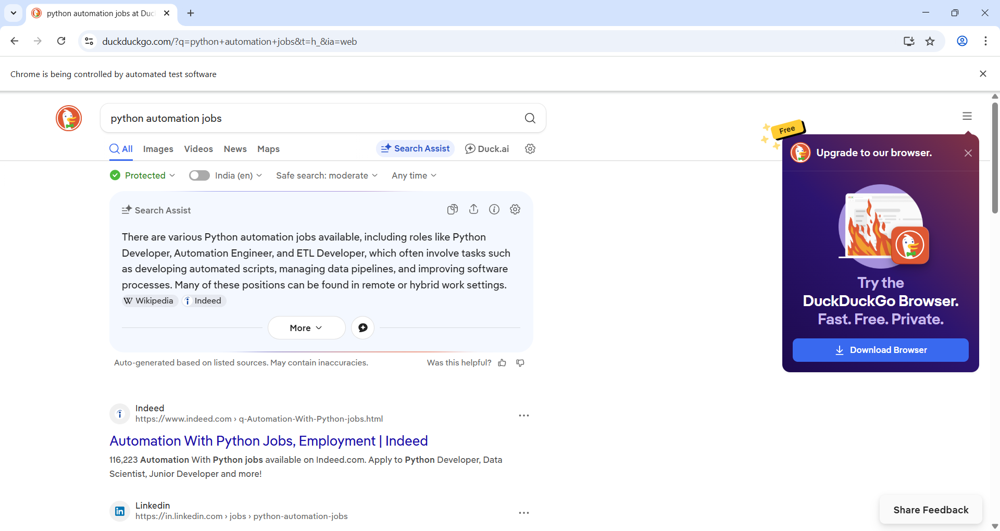

🔍  Search Automation Bot

This project is a simple automation script built using Python and Selenium. It automatically opens a browser, searches for a query, and clicks on the first result.

---

🚀 Features

- Opens browser automatically
- Searches for a keyword
- Clicks on the first result
- Simulates basic human-like interaction

---

🛠️ Technologies Used

- Python
- Selenium
- WebDriver Manager

---

📂 Project Structure

Search_bot/
│── main.py
│── screenshot.png
│── README.md

---

▶️ How to Run

1. Install dependencies:
   pip install selenium webdriver-manager

2. Run the script:
   python main.py

---

📸 Output Screenshot

---

💡 What I Learned

- How to use Selenium for browser automation
- Handling dynamic elements using WebDriverWait
- Automating search and click actions
- Debugging common Selenium errors

